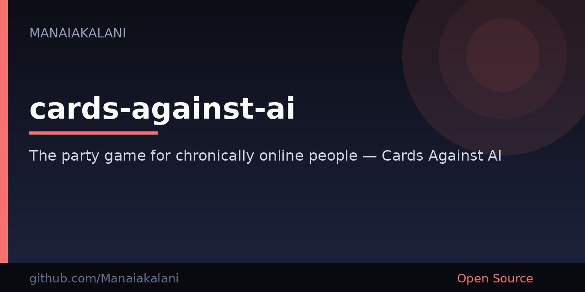

# Cards Against AI

**An open-source party card game for chronically online people.**

Fill-in-the-blank prompts about AI slop, Slack, startups, and 3am pages. Play in the browser — no account, no install. Host a live room, deal async when friends can't stay online, or go solo against bots.

[](https://github.com/Manaiakalani/cards-against-ai/actions/workflows/deploy.yml)
[](https://opensource.org/licenses/MIT)

**[Play now](https://cards.tinyinternet.company/)** · **[GitHub Pages](https://manaiakalani.github.io/cards-against-ai/)** · **[Submit a deck](https://github.com/Manaiakalani/cards-against-ai/issues/new)**

<p align="center">
  
</p>

## What

Cards Against AI is a **Cards Against Humanity-style** party game built for people who spend too much time on the internet, in Slack, and arguing about whether that alert is actually a Sev 2.

One player draws a black prompt card. Everyone else plays their funniest (worst?) white card. The Card Czar picks a winner. Repeat until someone questions their life choices.

## Why

Ten themed decks and **357 cards** roasting AI culture, startup life, crypto, Intune, and on-call. Real-time multiplayer via Supabase, async tables for people who cannot stay in the tab, and a solo mode with bots that needs zero setup.

## Try it

1. **Play in the browser** at [cards.tinyinternet.company](https://cards.tinyinternet.company/) (or the [GitHub Pages](https://manaiakalani.github.io/cards-against-ai/) mirror).
2. **Host a room** and share the code — or click **Play Async** and let friends take turns on their own time.
3. **Run it locally** if you want to hack on decks or the Next.js app:

```bash
git clone https://github.com/Manaiakalani/cards-against-ai.git
cd cards-against-ai
npm install
npm run dev
```

Open [http://localhost:3000](http://localhost:3000). Solo play against bots works with no extra config.



---

## Decks

| Deck | Cards | Vibe |
|------|------:|------|
| 🧠 Brainrot & AI Slop | 48 | Startup culture meets chronically online chaos |
| 💀 Terminally Online | 39 | Tech, memes, and the internet was a mistake |
| ✨ Unhinged Gen Z | 37 | Slay, situationships, and therapy-speak fluency |
| 🫠 Elder Millennial | 35 | Nostalgia, student loans, and "adulting is a scam" |
| 🤖 AI Fever Dream | 20 | GPT wrappers, vibe coding, and sentient toasters |
| 🎮 Gamer Lore | 22 | NPC behavior, rage quits, and RGB everything |
| 💎 Crypto & Web3 | 23 | NFT disasters, blockchain bros, and diamond hands |
| 🚀 Startup Life | 23 | Pitch decks, pivots, and ping pong tables |
| 🎯 InTuneD | 75 | Teams chaos, ADO nightmares, and Intune compliance disasters |
| 🚨 On-Call Nightmares | 35 | ICM bridges, PagerDuty, and 3am prod incidents |

**357 cards** across **10 decks**. All terrible. You're welcome.

## Features

- **Real-time multiplayer** via Supabase Realtime — host a room, share the code, ruin friendships
- **Async tables** so people can take turns on their own time — play a card, close the tab, come back later
- **Installable app + turn alerts** so a phone can ping you when it is your seat
- **Solo mode** with AI bots that have questionable taste
- **House rules** — Winner's Pick, Reboot the Universe, round timers
- **Neo-brutalist UI** that looks like a poster from a design school dropout
- **Dark mode** for gaming at 2am like a responsible adult
- **Stats & achievements** because we all need external validation
- **Favorites** — star your best combos for posterity (or blackmail)
- **Fully responsive** — phone, laptop, or the browser on whatever is nearby

## Run locally

Requires **Node 20+** and npm.

```bash
git clone https://github.com/Manaiakalani/cards-against-ai.git
cd cards-against-ai
npm install
npm run dev
```

Then open [http://localhost:3000](http://localhost:3000).

### Real-time multiplayer (optional)

For live rooms you need a [Supabase](https://supabase.com) project (free tier is enough):

```bash
cp .env.example .env.local
# Fill in NEXT_PUBLIC_SUPABASE_URL and NEXT_PUBLIC_SUPABASE_ANON_KEY
```

Without those env vars the game runs in single-player mode with bots. URL and keys stay in GitHub Actions secrets / `.env.local` — never in the repo.

`NEXT_PUBLIC_VAPID_PUBLIC_KEY` is optional and only needed if you want local turn-alert push testing.

### Async tables (optional)

Live rooms need everyone online. Async tables do not. Click **Play Async**, share the room code (or the `?room=` link). Friends play a card when they can; the czar judges whenever the last card lands.

## Tech stack

| Layer | Tech |
|-------|------|
| Framework | Next.js 16 (App Router) |
| Language | TypeScript |
| Styling | Tailwind CSS 4 |
| Animation | Framer Motion |
| Multiplayer | Supabase Realtime |
| Hosting | Azure Static Web Apps ([cards.tinyinternet.company](https://cards.tinyinternet.company/)); GitHub Pages mirror |
| Testing | Playwright e2e (desktop + mobile) |

## Contributing

Got a deck idea? A card that made you ugly-laugh? We want it.

1. **Submit a deck** via [GitHub Issues](https://github.com/Manaiakalani/cards-against-ai/issues/new)
2. **Open a PR** with new cards in `src/data/cards.ts` (and update counts in `src/data/deckMeta.ts` if you add or remove cards)
3. **Report bugs** (or "features" as we like to call them)

### Card format

```typescript
{ id: 'deck-w1', text: 'Your card text here', type: 'white', category: 'your-deck' }
{ id: 'deck-b1', text: 'Your prompt with _____.', type: 'black', blanks: 1, category: 'your-deck' }
```

## License

[MIT](./LICENSE) — do whatever you want, just don't blame us when HR gets involved.

---

<p align="center">
  <em>Built with questionable judgment and too much caffeine.</em>
  <br>
  <strong>Star this repo</strong> if it made you exhale through your nose.
</p>
